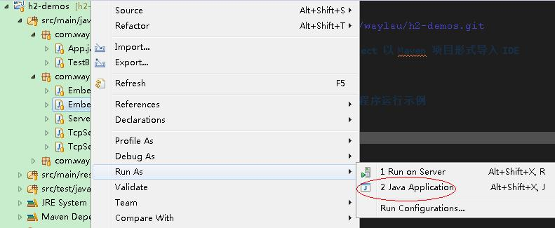

# h2-demos
Demos of  H2 Database Engine. 有关 H2 数据库的示例.

本项目所有示例均使用 Maven 项目管理。

## How to 如何使用

### Checkout Demos 检出项目 
	
	git clone https://github.com/waylau/h2-demos.git
	
### import the Damos as a Maven project 以 Maven 项目形式导入 IDE

本例 IDE 为 eclipse

### Run as Java Application 以 Java 程序运行示例

## Furhter Reading 延伸阅读

[Here](https://github.com/waylau/h2-database-doc) is a book about the H2 Database Engine.另外，《H2 Database 教程》是一本关于 H2 学习的教程,see <https://github.com/waylau/h2-database-doc>

